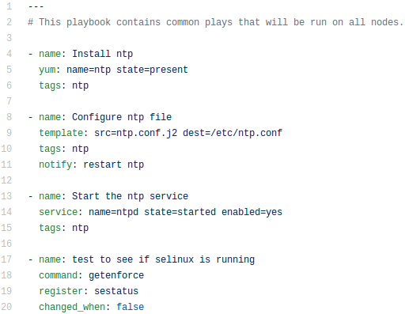
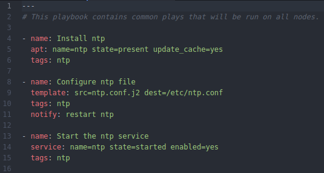
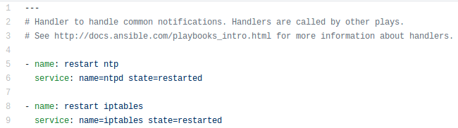
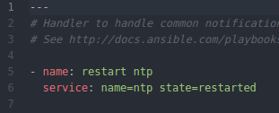

# Rol common #

Este rol se encarga de instalar el servicio NTP para sincronizar los tiempos UTC, en los Hosts del sistema.

## Tasks ##

Las tareas originalmente erán de la siguiente manera:

Y al momento de la migración la cual se realizo con tecnologia docker quedo de la siguiente forma:

Como se puede apreciar se ha retirado la tarea **test to see if selinus is running** por razones explicadas en el [README](https://github.com/jrnp97/ansible-to-migrate/blob/master/README.md#migraci%C3%B3n-de-scripts) principal.

En el cual tambien se explica el reemplazo de **yum** por **apt**.

## Handlers ##
Lo otro a resaltar es el cambio del manejador (handlers), el cual ejecutaba las siguientes tareas:

Y al momento de la migración quedo con las siguientes tareas

Al igual que las razones de le eliminación de la tarea que utilizaba SELinux las tareas que utilizan los servicios de iptables cuentan con su explicación en el [README](https://github.com/jrnp97/ansible-to-migrate/blob/master/README.md#migraci%C3%B3n-de-scripts) principal.
