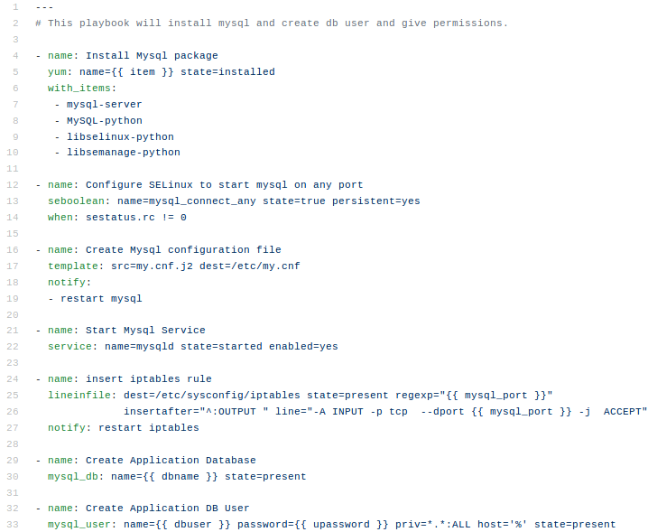
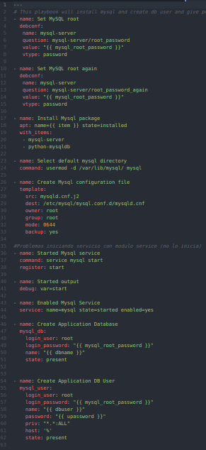
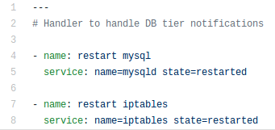
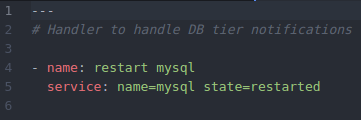

# Rol db #

Este es el rol que ha sufrido mas cambio debido a la naturaleza de directorios que se manejan en mysql-server sobre ubuntu y su instalación por medio de debconf y por un inconveniente con el modulo **service** teniendo el estado **state=startes** con mysql el cual no lo inica correctamente.

El estado de la tarea originalmente era:

Y actualmente es:

Como se puede observar se mantiene la misma logica, cambia el metodo de instalación se conserva simplemente se especifico la contraseña root con **debconf** para que la instalación se realizara en modo no-interactive sin problemas (ocurren si no se especifica el pwd root, experiencia vivida).

El modulo de python a instalar es **python-mysqldb**, se debe establecer el directorio por defecto de los contenidos generados por el servicio mysql, lo cual no se realizaba y podría generar conflictos en los host ubuntu.

Se realizo el cambio de la ruta donde se anexaba el archivo de configuración la cual es originalmente */etc/mysql/mysql.conf.d/mysqld.cnf* para anexar configuraciones personalizadas.

Al archivo de configuración se le anexaron variables que no se incluian algunas de las cuales especificaban directorios de log, maximo de memoria cache, lo cual se consideraría importante.

En la parte del inicio del servicio debido a lo comentado, proceso a iniciarlo directamente por comando y habilitarlo con el modulo *service* (eso si lo hace).

Respecto a la configuación de usuario y creación de DB queda practicamente igual, excepto que anexo los atributos **login_user y login_password** para asegurar que la conexión con mysql se realice correctamente, de lo contrario no iniciará, ya que el archivo *.my.cnf* referenciado no existe en el directorio */root/* y lo recomendado es mantenerlo así.

## Handlers ##

Respecto a los Handlers simplemente se quito la tarea que reinicia el servicio iptables, entonces al principio erá:

Y actualmente es:

Para mas información consultar el [README](https://github.com/jrnp97/ansible-to-migrate/blob/master/README.md#migraci%C3%B3n-de-scripts) principal.
