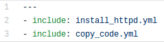
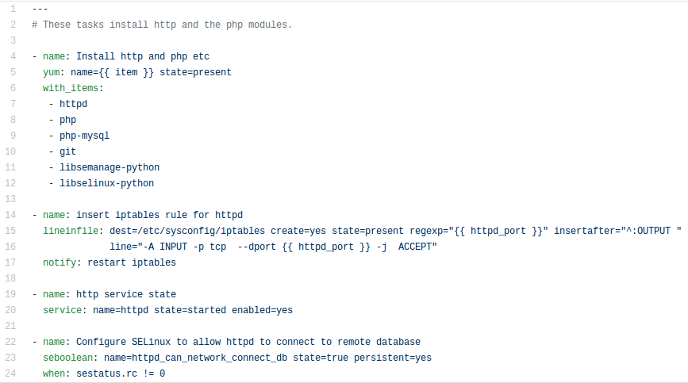
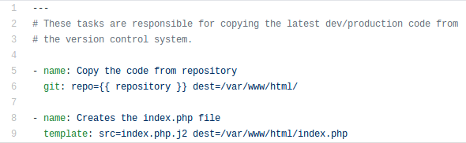
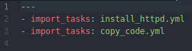
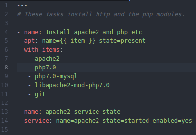
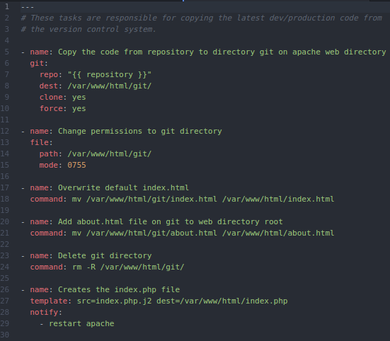
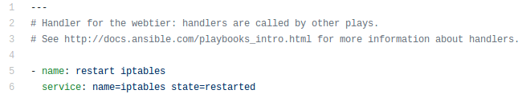
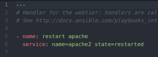

# Rol web #

El cambio de este rol es minimo al igual que en el rol common, al implementar la migración utilizando tecnologias docker se hizo retiro de las tareas con uso de **iptables y SELinux** las razones se explican claramente en el [README](https://github.com/jrnp97/ansible-to-migrate/blob/master/README.md#migraci%C3%B3n-de-scripts) principal.

## Tasks ##

Las tareas originales erán:

- **main.yml**

- **install_httpd.yml**

- **copy_code.yml**

Las tareas migradas quedaron de la siguiente forma:

- **main.yml**

- **install_httpd.yml**

- **copy_code.yml**

Los cambios realizados a las tareas en **main.yml** se ha debido al estado en que se encuentra el modulo **include** en la actual versión estable de ansible (2.4).

Los cambios realizados a las tareas en **install_httpd.yml** en sus paquetes a instalar a la actualización de php a la versión estable 7.0 y el equivalente paquete de **httpd** en ubuntu el cual es **apache2** debido a este ultimo se instala el paquete *libapache2-mod-php7.0* para permitir la ejecución de codigo php, las razones de exclisión de tareas (remover) ya han sido dadas.

Los cambios realizados a las tareas en **copy_code.yml** se han debido a el error de escritura al momento de clonar un repositorio directamente en el directorio **/var/www/html/** lo cual genera una excepción ya que dicho escritorio está creado.

Por ende se ha realizado el proceso de clonar el repositorio, mover si contenido al directorio objetivo ya mencionado y eliminar la clonación de este.

## Handlers ##

Respecto a los manejadores que originalmente erán:

y actualmente es:

Las razones de la eliminación de **iptables** ya han sido dadas, y se recurrio a la creación de un manejador que reiniciará apache2, el cual se utiliza en la tarea **copy_code.yml**
